<p align="center">
  <picture>
    <source media="(prefers-color-scheme: dark)" srcset="docs/media/banner-dark.svg">
    <source media="(prefers-color-scheme: light)" srcset="docs/media/banner-light.svg">
    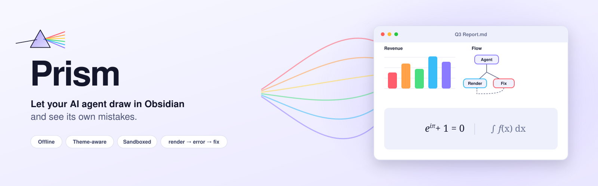
  </picture>
</p>

<p align="center">
  Interactive charts, diagrams, dashboards and formulas right inside your notes.<br>
  Offline, in your vault's theme, safely sandboxed – and built so Claude Code and Codex can render, check and fix what they write.
</p>

<p align="center">
  <a href="https://github.com/floorianmb/prism-viz/releases/latest"></a>
  
  
  <a href="LICENSE"></a>
</p>

<p align="center">
  <a href="#install">Install</a> ·
  <a href="#quickstart">Quickstart</a> ·
  <a href="#use-it-with-claude-code-or-codex">With AI agents</a> ·
  <a href="#features">Features</a> ·
  <a href="examples/">Example vault</a>
</p>

<p align="center">
  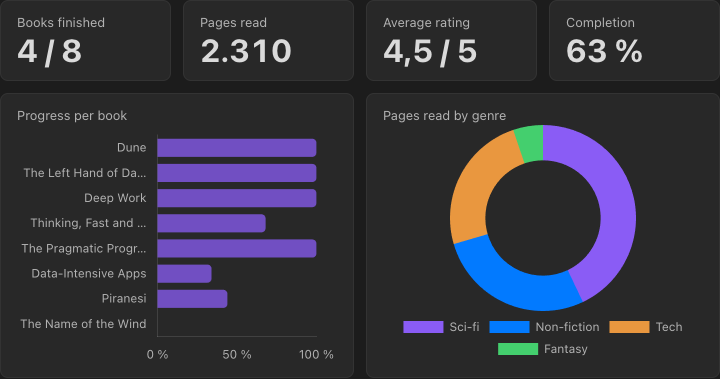
  <br><sub>A dashboard built from a plain Markdown table in the same note. Edit the table and the charts follow.</sub>
</p>

<table>
  <tr>
    <td width="50%">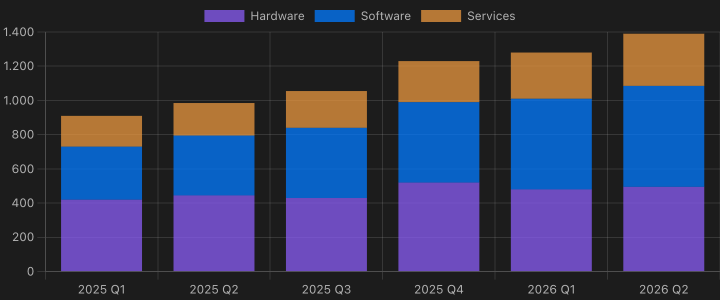<br><sub><b>No-code charts</b>: a YAML spec pointing at a table</sub></td>
    <td width="50%">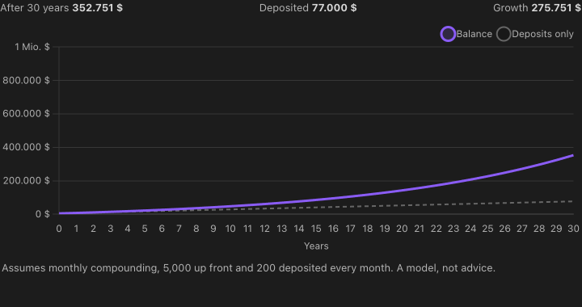<br><sub><b>Explorable explanations</b>: a slider in one block drives a chart in another</sub></td>
  </tr>
  <tr>
    <td>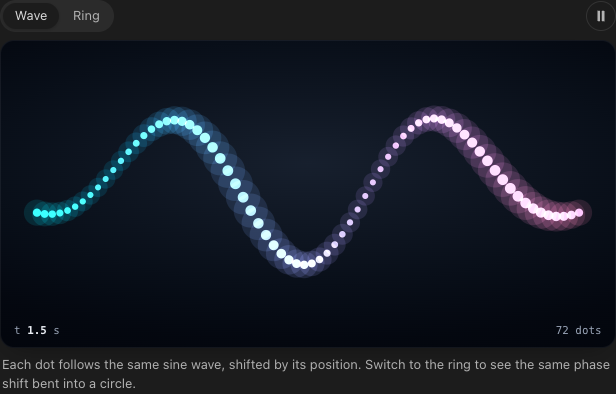<br><sub><b>Scenes</b>: <code>prism.canvas</code> + <code>prism.animate</code>, paused off screen</sub></td>
    <td>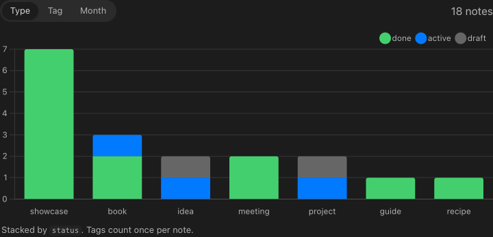<br><sub><b>Your vault as data</b>: <code>prism.notes()</code> over frontmatter</sub></td>
  </tr>
  <tr>
    <td>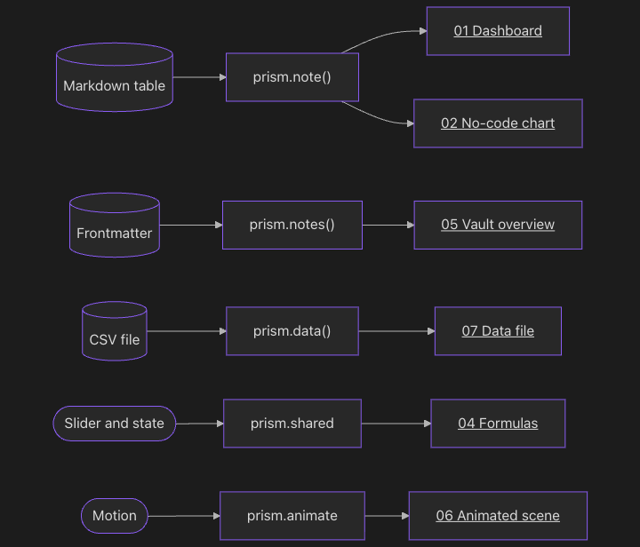<br><sub><b>Mermaid</b>: <code>[[links]]</code> in nodes open the note</sub></td>
    <td><br><sub><b>Formulas</b>: KaTeX, offline, with mhchem</sub></td>
  </tr>
  <tr>
    <td>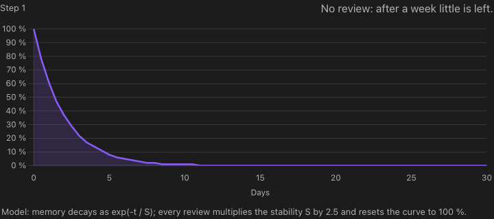<br><sub><b>Scrollytelling</b>: the chart follows the section you are reading</sub></td>
    <td>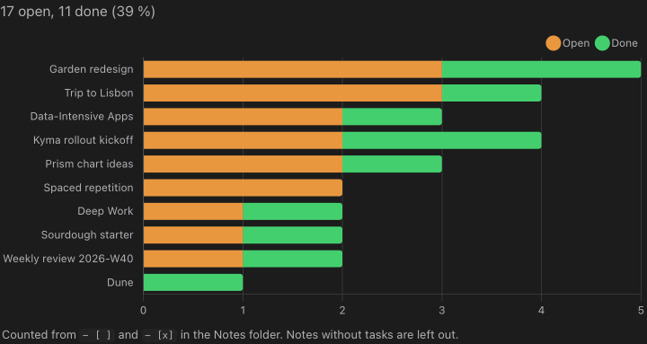<br><sub><b>Tasks across the vault</b>: <code>prism.notes({ include: ["tasks"] })</code></sub></td>
  </tr>
  <tr>
    <td>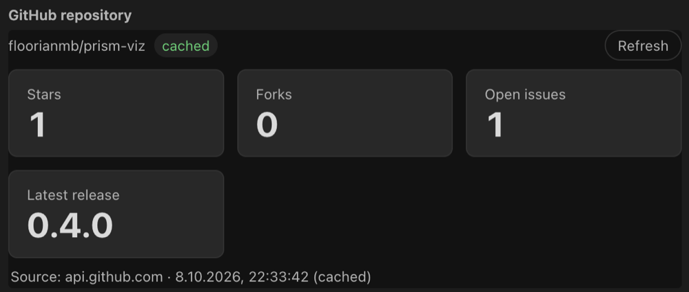<br><sub><b>Live API data</b> (opt-in): <code>prism.http.json</code>, sent by Obsidian, no CORS</sub></td>
    <td>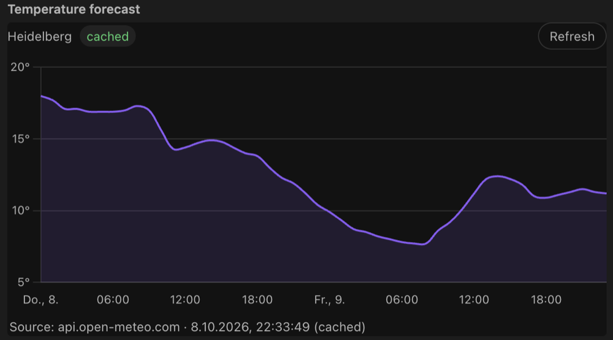<br><sub><b>Charts from web APIs</b>: cached in <code>prism.state</code>, every loading state handled</sub></td>
  </tr>
  <tr>
    <td>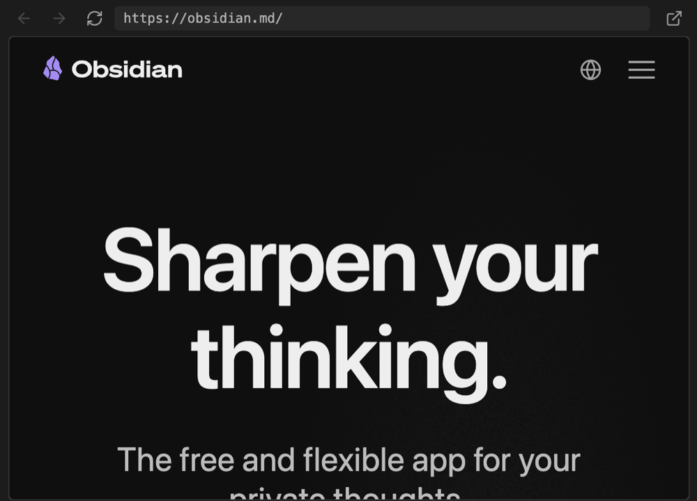<br><sub><b>Web pages</b> (opt-in): <code>```viz web</code> as a desktop webview, works for sites that refuse framing</sub></td>
    <td>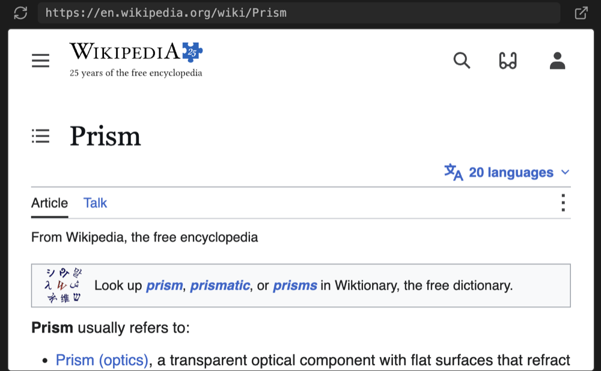<br><sub><b>…or as an iframe</b>: <code>mode: iframe</code>, also on mobile</sub></td>
  </tr>
</table>

<p align="center"><sub>All of these are in the <a href="examples/">example vault</a>, together with variants, a link graph, the page monitor, a Bases chart and an HTML widget. Screenshots are real renders in Obsidian's default dark theme.</sub></p>


## Why Prism?

- **🤖 Built for agents.** Your agent writes a ` ```viz ` block, renders the note from the command line and gets back errors *with note line numbers* plus a PNG snapshot. It fixes the block until the render is clean, with no copy-pasting screenshots back and forth. A ready-made skill teaches Claude Code and Codex how to do it.
- **📒 Your notes are the data.** Chart a Markdown table, the frontmatter of every note, your tasks, links and backlinks, or a CSV in your vault. Edit the note and the chart follows.
- **🎨 Looks like it belongs.** Blocks pick up your theme's colors and fonts, switch live between light and dark, size themselves and show up in PDF exports.
- **🔒 Safe by default.** Every block runs in a sandboxed iframe with a strict CSP and no network access. Chart.js, D3, Mermaid, three.js and KaTeX are bundled, so everything works offline.

## Install

Prism is not in the community plugin list yet. Until then:

**With [BRAT](https://github.com/TfTHacker/obsidian42-brat)** (recommended, gets updates automatically)
1. Install and enable *BRAT* from the community plugins.
2. Run *BRAT: Add a beta plugin for testing* and enter `floorianmb/prism-viz`.
3. Enable **Prism** under *Settings → Community plugins*.

**Manually**
1. Download `main.js`, `manifest.json` and `styles.css` from the [latest release](https://github.com/floorianmb/prism-viz/releases/latest).
2. Put them into `<your vault>/.obsidian/plugins/prism-viz/`.
3. Reload Obsidian and enable **Prism**.

**Just looking?** Open the [`examples/`](examples/) folder as a vault. It has a note for every feature.

## Quickstart

Put a table in a note and add a chart below it. No code needed:

````markdown
| Month | Notes | Tasks done |
| ----- | ----: | ---------: |
| Jan   |    34 |         21 |
| Feb   |    41 |         29 |
| Mar   |    57 |         38 |
^stats

```viz chart title="My vault in Q1"
type: bar
source: ^stats
x: Month
```
````

Change a number in the table and the chart updates. Want more? A ` ```viz ` block takes any HTML, SVG and JavaScript, with the bundled libraries and a `prism` API for your notes:

````markdown
```viz chart title="Notes by type"
<canvas id="c"></canvas>
<script>
prism.notes().then(notes => {
  const counts = {};
  for (const n of notes) { const t = n.frontmatter.type ?? "(none)"; counts[t] = (counts[t] || 0) + 1; }
  new Chart(c, { type: "bar", data: { labels: Object.keys(counts), datasets: [{ data: Object.values(counts) }] },
                 options: { plugins: { legend: { display: false } } } });
});
</script>
```
````

Or start from a template: *Prism: Insert starter* (dashboard, architecture diagram, timeline, chart from frontmatter, chart from a table, formula).

## Use it with Claude Code or Codex

1. **Install the skill** (from a clone of this repo): `npm run install-skill`. It copies [`skill/`](skill/) to `~/.claude/skills/prism` and `~/.codex/skills/prism`, wherever those folders exist.
   Alternatively run *Prism: Generate agent rules* in Obsidian. It writes `PRISM.md` and a snippet for your `CLAUDE.md` / `AGENTS.md`.
2. **Ask for a visualization**, e.g. *"Add a dashboard of my reading list to Books.md"*.
3. **The agent closes the loop** on its own:

   ```bash
   node .obsidian/plugins/prism-viz/scripts/prism-render.mjs "Books.md"
   ```

   The note renders invisibly in the running Obsidian app. The command prints JSON with every error (note line, origin, message) and the paths of the PNG snapshots, and exits with `0` = ok, `1` = block errors, `2` = render failed, `3` = Obsidian not reachable. The agent fixes the block, looks at the snapshot and renders again until the result is clean.

If something breaks while you are reading, use *Copy prompt for agent* in the block's menu or error panel. It copies the location, the errors, the source and the render command, ready to paste.

## Features

<details>
<summary><b>Visualize anything</b>: HTML/JS blocks, no-code charts, tables, formulas, Mermaid, Bases, HTML files</summary>

- **`viz` code blocks** (Live Preview and Reading view): HTML fragment or full document, rendered in an iframe via `srcdoc`. Info line: library keywords `chart`, `d3`, `mermaid`, `three`, plus `height=N`, `title="…"`, `id=name`, `raw`, `eager`, `notoolbar`, `source`. All libraries are bundled into `main.js`.
- **No-code charts**: a ```` ```viz chart ```` block may contain a YAML spec instead of HTML (`type`, `source: ^table-id | table:<heading> | file.csv`, `x`, `y`, `series`, `filter`, `sort`, `stacked` …).
- **Tables**: ```` ```viz table ```` renders a searchable, sortable table with locale number formats, source links and confidence badges.
- **Formulas**: ```` ```viz math ```` renders LaTeX with KaTeX (offline, fonts inlined, mhchem).
- **Mermaid that navigates**: `A["[[Note]]"]` labels open the note on click.
- **Bases**: a "Prism chart" view for `.base` files (Obsidian 1.10+): group by a property, count or aggregate a value, split into series, stacked, sorted.
- **HTML files**: `![[file.html]]` embeds use the same renderer, and `.html` files open in a Prism view. Options via `<meta name="prism" content="chart height=400">`, `<!-- prism: … -->` or `![[file.html|height=400]]`.
- **Page monitor**: ```` ```viz monitor ```` shows RAM and CPU of the page it is on.

</details>

<details>
<summary><b>Your notes as data</b>: tables, frontmatter, tasks, links, CSV/JSON files</summary>

- **`prism.note()`** returns the block's own note: frontmatter, headings, links, backlinks, tasks and typed Markdown tables (German number formats, units, `–` as empty). `prism.onNoteChange` follows edits.
- **`prism.notes({ folder, tag, limit, sort, order, include })`** queries the vault (read-only path, title, tags, frontmatter, mtime). `include: ["links", "backlinks", "headings", "tasks"]` adds those per note, and tasks carry Tasks-plugin dates and priorities. `prism.onNotesChange` fires on changes.
- **Data files**: `prism.data("folder/file.csv")` reads CSV/TSV (row objects, column-wise typed), JSON/GeoJSON, YAML and TXT. Access is read-only and limited to the folders listed under *Data folders* in the settings (empty = off; notes and hidden files are never readable). `prism.dataFiles(folder?)` lists them, `prism.onDataChange(cb)` follows changes, and `prism.parseCsv(text)` parses inline CSV.

</details>

<details>
<summary><b>Explorable explanations and scenes</b>: shared state, sliders, scrollytelling, animation</summary>

- **Shared state**: `prism.shared` is state shared by all blocks of a note. `prism.state.bind` / `prism.shared.bind` two-way bind form controls, so a slider in one block can drive charts in others.
- **Scrollytelling**: `prism.onSection(cb)` reports the heading the reader is at while scrolling.
- **Variants**: `prism.variants` shows alternative views of the same content with a persisted switcher.
- **Building blocks**: `prism.canvas` (crisp canvas that follows its element), `prism.animate` (frame loop with real elapsed time that pauses off screen and respects reduced motion), `prism.segmented` (persisted segmented control) and the classes `.toolbar`, `.stage`, `.hud`, `.chip`, `.icon-button`, `.caption`.
- **Persisted state**: `prism.state.get/set/delete` is stored in the plugin data, and `localStorage` is shimmed onto it.

</details>

<details>
<summary><b>Built for agents</b>: headless render CLI, error log with note lines, skill, gallery</summary>

- **Render on demand**: `obsidian://prism?render=<note path>[&id=…&snapshot=0&width=720&timeout=60]` renders every viz block of a note (or an HTML file) invisibly in the running app and writes `.prism/renders/<id>.json` and `latest.json` (status, errors with note lines, snapshot paths). The CLI `scripts/prism-render.mjs` wraps it. `--all [folder]` renders every note with viz blocks and prints a summary. On macOS Obsidian stays in the background.
- **Error feedback**: `window.onerror`, unhandled rejections, `console.error`, CSP violations, Mermaid errors and timeouts show up as a badge and are written to `<vault>/.prism/errors.json` with note path and line numbers. Optional PNG snapshots go to `.prism/snapshots/`.
- **Agent skill** ([`skill/`](skill/)): `SKILL.md` with the plan → write → render → fix workflow, `design.md` with the quality bar, and `reference.md` with the full API.
- **Gallery**: *Prism: Open gallery* lists every viz block of the vault with its latest snapshot and render status. *Render previews* renders the missing ones.

</details>

<details>
<summary><b>Feels native</b>: theme bridge, auto-height, page previews, fullscreen, PDF export, toolbar</summary>

- **Theme bridge**: Obsidian's CSS variables (colors, fonts, sizes, palette) are available inside the frame and update live on theme and light/dark changes. A default stylesheet and helper classes (`.card`, `.grid`, `.row`, `.kpi`, …) are included; opt out with `raw`. Chart.js and Mermaid follow the theme automatically.
- **Auto-height** via `ResizeObserver`, cached per block so re-renders do not jump.
- **Page previews**: note links inside blocks show Obsidian's hover preview (`prism.hoverNote` for canvas/SVG hit areas). Blocks know about fullscreen via `prism.displayMode`.
- **PDF export**: each block is rendered in the light theme and replaced by a static PNG.
- **Hover toolbar**: source, reload, fullscreen, PNG export, plus copy as PNG, record a 5 s WebM video, SVG export, save as `.html`, copy source / errors and *Copy prompt for agent*.

</details>

<details>
<summary><b>Safe by default</b>: sandbox, CSP, no network, loop guard</summary>

- **Sandbox**: `sandbox="allow-scripts"` (no same-origin, top navigation, popups, forms or modals) and the CSP `default-src 'none'; script-src 'unsafe-inline'; style-src 'unsafe-inline'; img-src data: blob:; font-src data:;` plus `base-uri`/`form-action 'none'`. Messages are accepted only from the block's own frame with a per-render token, and navigation away from the srcdoc is detected and reverted.
- **Network is off** unless you allowlist domains. **Online access** is opt-in and off by default: *API requests* (`prism.http`, requests wait for a click by default) and *Web pages* (` ```viz web ` blocks, iframes). Turning either on shows the consequences and asks for confirmation.
- **Robustness**: lazy rendering, loops in user scripts are stopped after 2 s of blocking, a ready/heartbeat watchdog with a Stop button, a crash guard that does not auto-run a block that froze Obsidian before, and full cleanup on unload.

</details>

The complete API is documented in [`skill/reference.md`](skill/reference.md).

## Settings

Default height, maximum auto height, theme sync, lazy rendering, error log, snapshots, data folders, network allowlist and online access.

## Development

```bash
npm install
npm run build   # type-check, bundle the libraries and main.js, generate skill/reference.md
npm run dev     # watch mode
```

The runtime files are `manifest.json`, `main.js` and `styles.css`. Pushing a tag that matches the manifest version (e.g. `0.3.0`) builds them and publishes a GitHub release.

<details>
<summary>Project layout</summary>

```
main.ts                   plugin: code block processor, commands, notes query, exports, snapshots
src/frame.ts              one rendered block: iframe lifecycle, message bridge, toolbar, errors, watchdogs
src/document.ts           srcdoc builder (CSP, theme, base CSS, libraries) and line map
src/runtime/prelude.ts    iframe runtime (window.prism), bundled to a string at build time
src/runtime/chartSpec.ts  declarative chart spec → Chart.js config
src/runtime/table.ts      interactive table for ```viz table / prism.table
src/noteInfo.ts           note tables, headings and tasks for prism.note() / prism.notes({ include })
src/basesView.ts          "Prism chart" view for Obsidian Bases
src/loopGuard.ts          infinite-loop instrumentation (acorn)
src/theme.ts              Obsidian theme → CSS variables
src/errorLog.ts           .prism/errors.json
src/htmlFile.ts           .html view and embeds
src/data.ts               data file path resolution and allowlist
src/perf/                 page monitor: block stats, Electron process metrics
src/online/               opt-in network access: settings + consent, prism.http, ```viz web blocks
scripts/prism-render.mjs  CLI for agents (render a note, print JSON)
scripts/build-skill.mjs   skill/reference.md from src/agentRules.ts (part of npm run build)
scripts/install-skill.mjs installs skill/ for Codex and Claude Code
examples/                 example vault with a note per feature
```

</details>

## Limits

- `errors.json` reflects the last render, either when a block was visible in Obsidian or via `obsidian://prism?render=…`. The render command needs the desktop app (it launches Obsidian if it is not running).
- `![[file.html]]` embeds use Obsidian's internal embed registry. If it is unavailable, embeds fall back to Reading view only.
- PNG export and snapshots use html-to-image. WebGL canvases need `preserveDrawingBuffer: true`, and export needs the block to be visible.

## License

MIT, see [`LICENSE`](LICENSE). Third-party licenses: [`THIRD_PARTY_LICENSES.txt`](THIRD_PARTY_LICENSES.txt).
